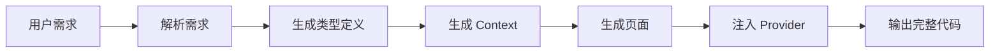

# 🚀 模板使用指南

## 快速开始

### 方式一：手动集成（推荐给 AI）

**步骤 1：读取模板结构**
```bash
# AI 系统读取整个 codebanana_app_templates 目录
```

**步骤 2：理解用户需求**
```
用户输入："我想开发一个 [功能描述] 的 App"
```

**步骤 3：生成代码**
```
按照 AI_CODING_GUIDE.md 的规范生成：
1. types/[业务名].ts
2. contexts/[业务名]Context.tsx
3. app/(tabs)/index.tsx（覆盖）
4. app/_layout.tsx（添加 Provider）
```

**步骤 4：输出完整项目**
```
输出包含所有模板文件 + 新生成文件的完整目录
```

---

### 方式二：开发者使用

**步骤 1：复制模板**
```bash
cp -r codebanana_app_templates my-new-app
cd my-new-app
```

**步骤 2：安装依赖**
```bash
npm install
# 或
bun install
```

**步骤 3：启动开发**
```bash
npm start
```

**步骤 4：根据需求开发**
参考 `AI_CODING_GUIDE.md` 编写业务代码。

---

## 📝 AI 系统集成示例

### 输入示例

```json
{
  "template": "codebanana_app_templates/",
  "userRequirement": "开发一个记账 App，可以添加收支记录，按类别统计"
}
```

### 处理流程



### 输出示例

生成的文件结构：
```
my-expense-app/
├── [所有模板文件]
├── types/
│   └── expense.ts          ← 新增
├── contexts/
│   └── ExpenseContext.tsx  ← 新增
└── app/
    ├── _layout.tsx         ← 修改（添加 Provider）
    └── (tabs)/
        └── index.tsx       ← 修改（实现记账功能）
```

---

## 🎯 常见场景示例

### 场景 1：简单 CRUD App

**需求**："待办事项 App"

**生成文件**：
- `types/todo.ts`
- `contexts/TodoContext.tsx`
- `app/(tabs)/index.tsx`

**关键功能**：
- 添加待办
- 标记完成
- 删除待办
- 本地存储

---

### 场景 2：带分类的 App

**需求**："记账 App，支持收入/支出分类"

**生成文件**：
- `types/expense.ts` + `types/category.ts`
- `contexts/ExpenseContext.tsx`
- `constants/expenseCategories.ts`
- `app/(tabs)/index.tsx`
- `components/CategoryPicker.tsx`（可选）

**关键功能**：
- 添加收支记录
- 选择分类
- 统计图表
- 筛选记录

---

### 场景 3：多页面 App

**需求**："社交 App，有动态、消息、个人中心"

**生成文件**：
- `types/post.ts` + `types/message.ts` + `types/user.ts`
- `contexts/SocialContext.tsx`
- `app/(tabs)/index.tsx`（动态）
- `app/(tabs)/messages.tsx`（新增 Tab）
- `app/(tabs)/profile.tsx`（新增 Tab）
- `app/(tabs)/_layout.tsx`（修改：添加新 Tab）

---

## ⚙️ 配置说明

### 修改应用名称

```json
// app.json
{
  "expo": {
    "name": "你的应用名称",
    "slug": "your-app-slug"
  }
}
```

### 修改主题色

```tsx
// constants/colors.ts
const tintColorLight = "#007AFF";  // 改为你的品牌色
```

### 添加图标

将图标文件放入 `assets/images/` 目录（需创建）

---

## 🐛 故障排查

### 问题 1：Provider 未生效

**症状**：`useContext` 报错

**解决**：检查 `app/_layout.tsx` 是否正确注入 Provider

```tsx
<YourProvider>  {/* ← 确保添加了 */}
  <GestureHandlerRootView>
    <RootLayoutNav />
  </GestureHandlerRootView>
</YourProvider>
```

---

### 问题 2：类型错误

**症状**：TypeScript 报错

**解决**：
1. 检查 `types/` 目录的导出
2. 确保 `import` 路径使用 `@/` 别名
3. 运行 `npm run lint` 检查

---

### 问题 3：存储无效

**症状**：数据未保存

**解决**：
1. 检查是否调用 `await storage.set()`
2. 确保 AsyncStorage 已正确安装
3. 查看控制台错误日志

---

## 📚 参考文档

1. **AI_CODING_GUIDE.md**：AI 生成代码的详细规范
2. **TEMPLATE_STRUCTURE.md**：模板结构说明
3. **README.md**：项目运行指南

---

## 🎓 最佳实践

### ✅ DO

- 遵循 `AI_CODING_GUIDE.md` 的编码规范
- 使用 TypeScript 严格类型
- 使用 `useCallback` 和 `useMemo` 优化性能
- 使用 `storage` 工具进行持久化
- 适配安全区域（刘海屏）

### ❌ DON'T

- 不要修改核心配置文件
- 不要在组件内直接使用 AsyncStorage
- 不要忽略 TypeScript 类型检查
- 不要使用内联样式（用 StyleSheet）
- 不要在主线程执行耗时操作

---

## 📞 支持

如有问题，请参考：
1. Expo 官方文档：https://docs.expo.dev/
2. React Native 文档：https://reactnative.dev/
3. TypeScript 文档：https://www.typescriptlang.org/

---

**模板版本**：1.0.0  
**更新日期**：2024年  
**适用框架**：Expo 53+ / React Native 0.79+

